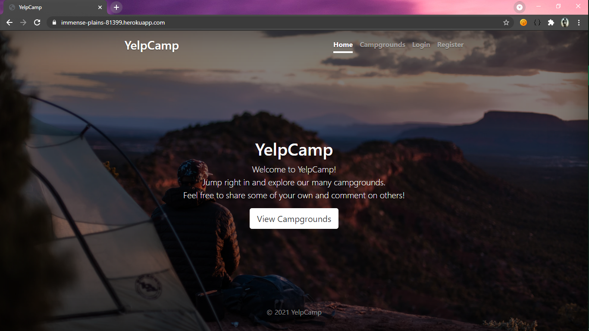

# YelpCamp (A Yelp Clone)
This is an attempt at cloning some of the features present on the famous review site, with some different aspects and personal touches.

It allows users to register with the website, search different campgrounds, read their reviews, leave a review of their own, and add their own campgrounds.
It also contains embedded maps to help users get a better idea of the geographical locations of the campgrounds.

## Deployed at
https://immense-plains-81399.herokuapp.com/

